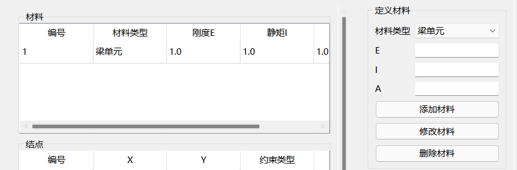
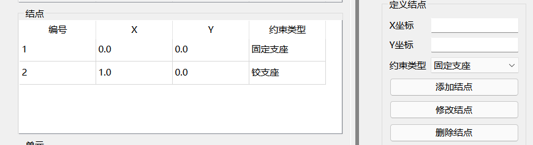
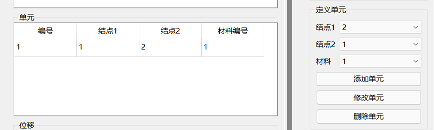
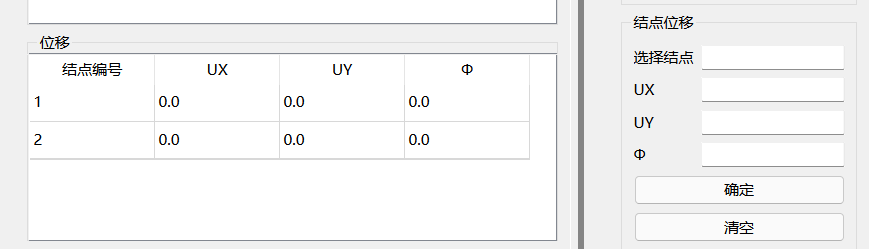
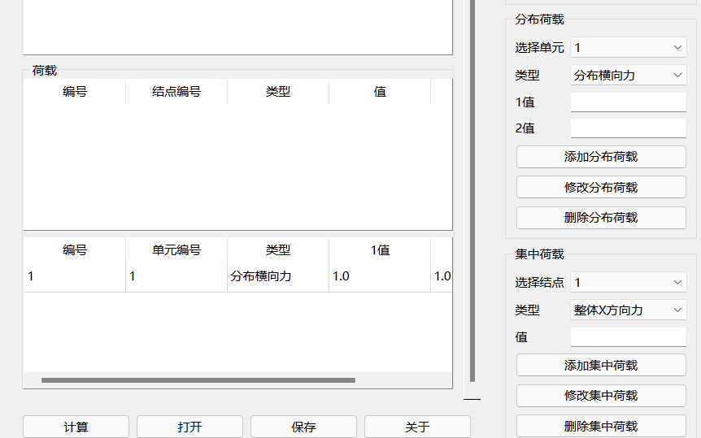

# 矩阵位移法力学求解器

## 1.介绍

这是一个基于 **Python Qt GUI** 开发的平面刚架静力分析程序，使用方法基本和《结构力学》书本上的程序一致，由于没有书本上的源程序的代码，界面和算法都是由我自己写的，目前功能还不是很完善，可能还存在一些bug。

## 2.功能

1. 计算结点位移，杆端力
2. 打开保存文件
3. 保存计算结果

## 3.运行

首先，确保安装的Python的版本大于3.10，以及安装了numpy和PySide6，通过在控制台输入`python main.py`即可

## 4.使用说明

1. 操作界面

   该程序的所有操作都通过主窗口右边的表单完成（结点耦合功能还不可用）

2. 操作流程

   选择对象的方法：单击对应对象表格所对应的行，就可以选择该对象，通过修改或删除按钮执行所需要的操作

   1. 添加材料

      

      首先为需要计算的单元添加材料，界面来自于书上，材料类型暂时不知道用处，在这个界面可以先添加不同的材料类型给不同的单元使用。

   2. 添加结点

      

      添加结点是添加单元的前一步骤，用于记录不同结点的坐标，对于约束类型有两个要求，一是每个结点都必须连接了单元，二是刚结点或铰结点必须连接了至少两个单元。

   3. 添加单元

      

      添加单元是这个程序的最重要的步骤，两个结点连接成一个单元，它规定了结点之间的连接方式，可以通过之前添加的结点和材料编号找到对应的材料，结点一和结点二必须是不同的结点

   4. 添加位移

      

      在添加结点后，或自动生成对应结点的初始位移，初始值为零，点击对象后可以对初始值进行修改

   5. 添加荷载

      

      荷载分为分布荷载和集中荷载，集中荷载作用在单元上，分布荷载作用在结点上，可以为不同的单元或者结点添加不同的荷载，对于相同类型的荷载，每个结点或者单元只能添加一个

   6. 计算

      所有操作完成后，点击计算，会自动计算相应结点的位移，杆端力，点击保存按钮，可以保存计算结果

### ver _0.0.1_
